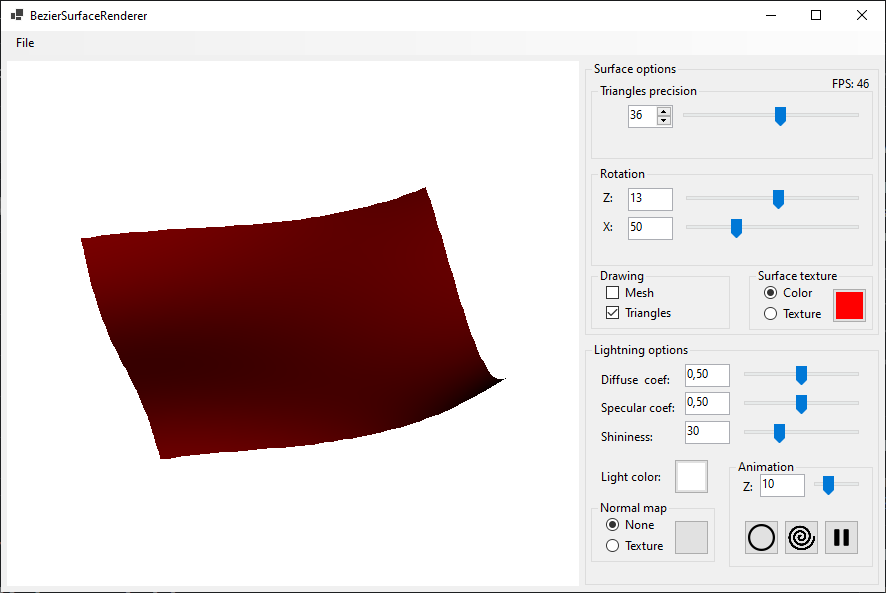
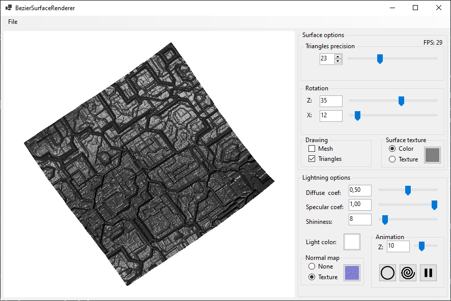
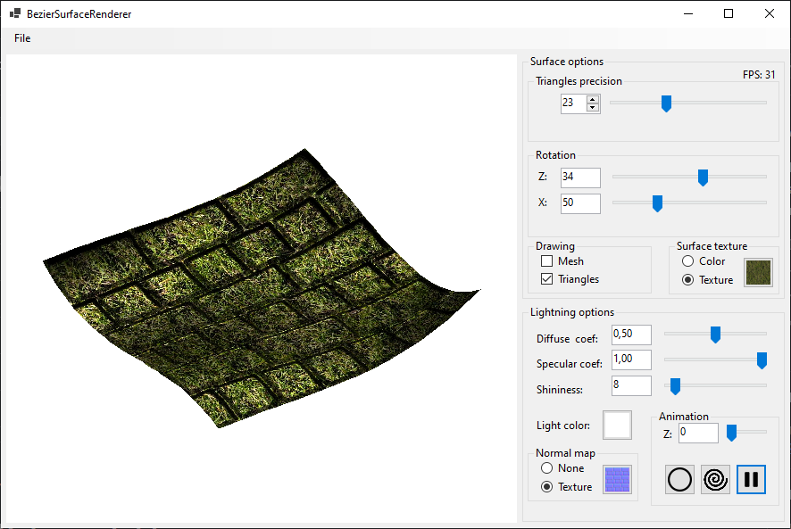
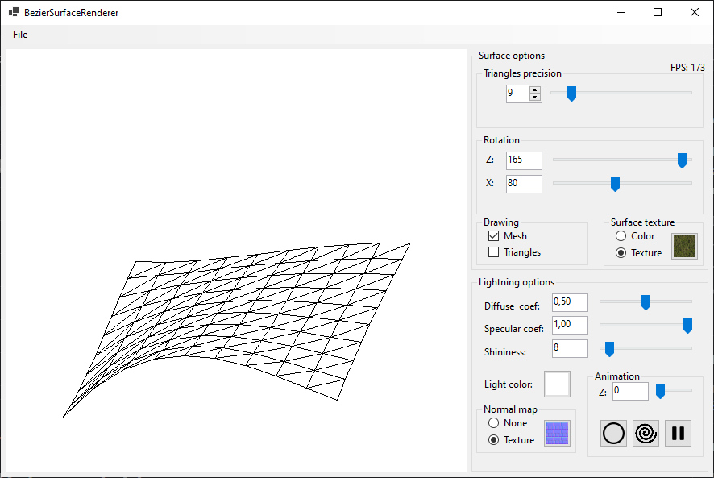

# BézierSurfaceRenderer

BézierSurfaceRenderer is an interactive application for rendering **third-degree Bézier surfaces** 
with support for **Phong lighting**, **textures**, and **normal mapping**.
The project was developed as part of a university graphics programming course,
focusing on implementing **polygon filling with scanline** on CPU.

<p align="center">
  
</p>

## Features

### Bézier Surface Rendering

- Renders a third-degree Bézier surface.
- Supports interactive rotation.
- Bézier surface is loaded from a text file containing 16 control points.
- Adjustable tessellation level to control the number of triangles used for surface approximation.
- Supports Z-buffering for proper depth handling.
- Surfaces can have color or texture applied.

### Lighting and Shading

- Implements the Phong lighting model with adjustable parameters:
  - Diffuse reflection (kd)
  - Specular reflection (ks)
  - Specular exponent
- Allows modification of light color.
- Surfaces can have normal map applied.

<p align="center">
  
</p>

### Light Animation

- Single light source.
- Adjustable Z-component of the light source.
- Two light movement animations:
  - Spiral path
  - Circular path
- Pause/resume animations at any time.

## Surface File Format

The Bézier surface control points are stored in a text file with 16 lines, each representing a control point (X, Y, Z coordinates).

Example:
```0.0 0.0 0.0
   1.0 0.5 0.0
   ...```

A few example surfaces, textures and normals are included in the Test folder.

<p align="center">
  
</p>

<p align="center">
  
</p>
